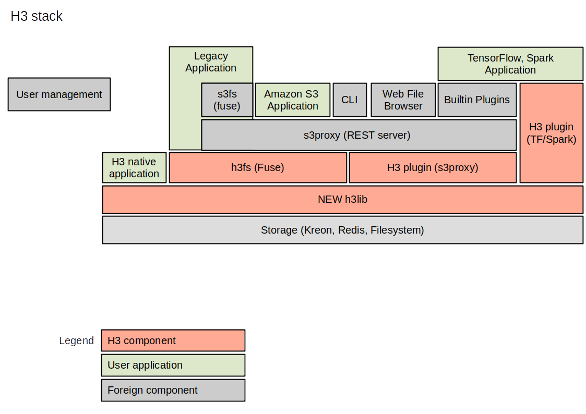

.. H3 documentation master file, created by
   sphinx-quickstart on Thu Nov 28 11:35:06 2019.
   You can adapt this file completely to your liking, but it should at least
   contain the root `toctree` directive.

Welcome to H3
=============

H3 is an embedded High speed, High volume, and High availability object store, backed by a high-performance key-value store.
H3 is implemented in the ``h3lib`` library, which provides a cloud-friendly API, similar to Amazon's S3. On the backend, H3 supports `RocksDB <https://rocksdb.org>`_ for single-node runs, `Redis <https://redis.io>`_ and - our own sister project - Kreon for distributed deployments, as well as plain files for layering on top of any filesystem (and easy testing).

``h3lib`` is written in C. Python and Java wrappers are also available.
We plan to implement an `Apache jclouds <http://jclouds.apache.org>`_ BlobStore provider plug-in, so you can use `s3proxy <https://github.com/gaul/s3proxy>`_ to provide a fully compatible S3 REST interface over H3. That will also allow layering `s3fs <https://github.com/s3fs-fuse/s3fs-fuse>`_ on top for fileystem semantics, although an H3 FUSE-based filesystem is also in the works, that will provide better performance.

.. toctree::
   :maxdepth: 2
   :caption: Contents:

   design
   installation
   configuration
   api

Indices and tables
==================

* :ref:`genindex`
* :ref:`modindex`
* :ref:`search`
